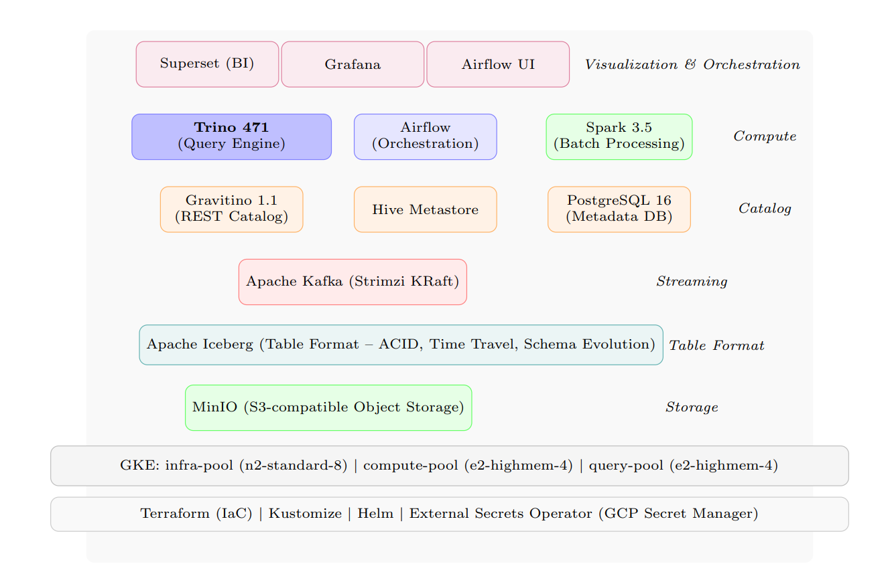

# 🌊 Modern Data Platform on Kubernetes (Lakehouse)

[](#-technology-stack)
[](#-infrastructure--cost-optimization)
[](#-infrastructure--cost-optimization)

A professional-grade, cost-optimized Modern Data Platform built on **Google Kubernetes Engine (GKE)**. This project implements a full-stack, open-source data infrastructure optimized for high-scale processing and experimentation using a **100% Spot Instances** strategy to minimize cloud expenditure.

---

## 🏛️ Architecture Overview

The platform leverages a **Lakehouse architecture**, combining the cost-efficiency and flexibility of a Data Lake with the performance and ACID guarantees of a Data Warehouse.



### Core Design Principles:
- **Decoupled Compute & Storage**: Independent scaling of processing power (Spark/Trino) and data storage (MinIO/S3).
- **Open Standards**: Built entirely on open-source technologies (Iceberg, Spark, Trino, Kafka).
- **Unified Catalog**: Centralized metadata management via Gravitino and Hive Metastore.
- **Cost Efficiency**: Automated node pool management utilizing GKE Spot Instances.

---

## 🛠️ Technology Stack

| Layer | Component | Description |
| :--- | :--- | :--- |
| **Storage** | [MinIO](https://min.io/) | S3-compatible Object Storage for raw and processed data. |
| **Table Format** | [Apache Iceberg](https://iceberg.apache.org/) | High-performance open table format for huge analytic datasets. |
| **Catalog** | [Gravitino](https://gravitino.apache.org/) | Iceberg REST Catalog for unified metadata management. |
| **Processing** | [Apache Spark](https://spark.apache.org/) | Batch and streaming processing via Spark-on-K8s Operator. |
| **Streaming** | [Apache Kafka](https://kafka.apache.org/) | Real-time event streaming managed by Strimzi Operator. |
| **SQL Engine** | [Trino](https://trino.io/) | Distributed SQL query engine for ad-hoc analytics. |
| **Orchestration** | [Apache Airflow](https://airflow.apache.org/) | Workflow management for complex data pipelines. |
| **BI & Viz** | [Apache Superset](https://superset.apache.org/) | Modern data exploration and dashboarding platform. |
| **Monitoring** | [Prometheus](https://prometheus.io/) & [Grafana](https://grafana.com/) | Full-stack observability and alerting. |

---

## 📂 Repository Structure

The repository is strictly organized to separate infrastructure logic from application manifests and operational documentation.

```bash
k8s-data-platform/
├── assets/                  # Diagrams, images, and static resources
├── datagen/                 # Custom data generators for testing and demos
├── docs/                    # 📚 Deep documentation, ADRs, and Runbooks
│   ├── architecture/        
│   ├── decisions/           
│   └── runbooks/            
├── helm-values/             # Standardized Helm chart configurations
├── k8s/                     # Kubernetes manifests (Kustomize based)
│   ├── base/                
│   └── overlays/            
├── notebooks/               # Data exploration and research notebooks
├── pipelines/               # Data transformation logic (Bronze/Silver/Gold)
├── terraform/               # Infrastructure as Code for Cloud resources
└── scripts/                 # Utility scripts for platform management
```

---

## 📖 Documentation Index

For detailed guides, please refer to the following documentation sub-folders:

### 📐 [Architecture Docs](docs/architecture/)
- [Deployment Model](docs/architecture/deployment-model.md): Physical and logical component layout.
- [Node Pool Strategy](docs/architecture/node-pool-strategy.md): Detailed explanation of Spot Instance utilization.
- [Platform Overview](docs/architecture/overview.md): High-level system design.

### 📜 [Decision Records (ADRs)](docs/decisions/)
- Understand why specific technologies and patterns were chosen.

### 🛠️ [Operational Runbooks](docs/runbooks/)
- [Setup Guide](SETUP.md): Initial deployment instructions.
- [Scaling Guide](docs/runbooks/scaling.md): Instructions for resizing the cluster.
- [Backup & Recovery](docs/runbooks/backup.md): Data protection procedures.

---

## ⚡ Quick Start

### 1. Prerequisites
- Google Cloud Account (GCP)
- `gcloud`, `kubectl`, `terraform`, and `helm` installed.

### 2. Infrastructure Deployment
Navigate to the `terraform/` directory and apply the configuration to provision the GKE cluster:
```bash
terraform init
terraform apply
```

### 3. Platform Installation
Use the provided setup script to deploy all components:
```bash
./scripts/deploy-platform.sh
```

---

## 💰 Infrastructure & Cost Optimization

This platform is engineered for **minimal cloud bill**:
- **Spot Instances**: Using Preemptible VMs for all workloads.
- **Auto-Scaling**: GKE Cluster Autoscaler automatically resizes based on demand.
- **Storage Tiering**: Efficient data lifecycle management in MinIO.

For a detailed breakdown of the cost strategy, see [Node Pool Strategy](docs/architecture/node-pool-strategy.md).

---

## 🤝 Contributing
Contributions are welcome! Please read our [Contribution Guidelines](docs/CONTRIBUTING.md) and check our [Development Workflow](docs/runbooks/development.md).
